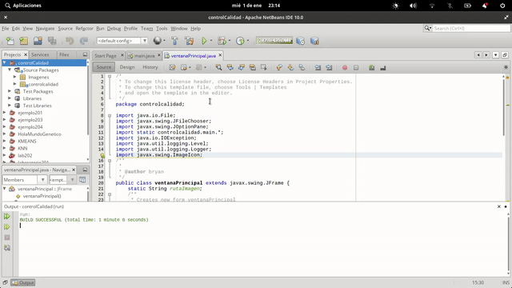

# programa De un Sistema Experto
Programa de automatización sobre el control calidad de jitomate con tratamiento imagenes y perceptrón

## Descripción
El programa se basa en el recocimiento del jitomate (tomate rojo), con la finalidad de separar aquellos que no cumplan ciertos criterios como:
* No tenga manchas el fruto.
  * ya sea de putrefacción 
  * ya sea por moho gris
* No cumpla con el color establecido (no este maduro).

